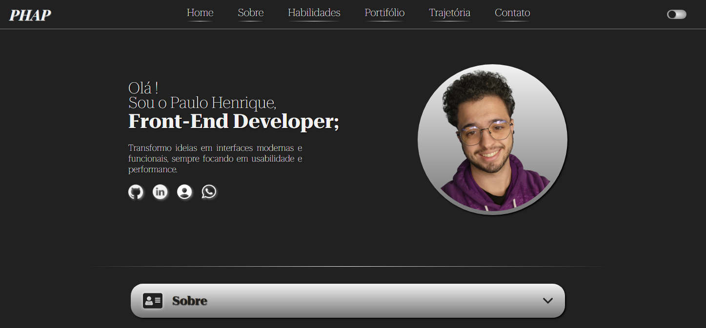

<h1 align="center">PHAP Portifolio</h1>
<h4 align="center">Criar um site Portifolio</h4>

 Este projeto é um portfólio online criado para me apresentar profissionalmente, compartilhar minha trajetória acadêmica e profissional, além de reunir de forma acessível os links dos meus projetos e trabalhos.

 Desenvolvi este site como um desafio pessoal, utilizando HTML, CSS e JavaScript puro, desde o início até a finalização. Para implementar funcionalidades que eu ainda não dominava na prática, consultei diversas fontes confiáveis, como blog técnico (como o Stack Overflow), documentações oficiais e ferramentas de apoio ao aprendizado, incluindo inteligência artificial, sempre com o objetivo de compreender e construir cada parte do projeto. 

<h2 id="challenges">🏆 Desafio. </h2>

Na [Versão 1.0](https://dev-phap.github.io/Phap_Portifolio/) - busquei desenvolver o projeto incorporando funcionalidades com as quais eu tinha apenas conhecimento teórico. Isso tornou o processo desafiador, mas me motivou a estudar a parte prática e aplicar esses aprendizados em recursos do site, como a alternância de tema claro/escuro (dark mode), entre outras funcionalidades listadas abaixo.

<h2 id="features">✨ Features</h2>

<h3>🌐 Globais</h3>
<ul>
  <li>Layout Responsivo para diferentes tamanhos de telas.</li>
  <li>Efeito Animação de Fade-in com leve translocação no eixo Y ao rolar a página.</li>
</ul>

<em>Funcionalidades globais</em>

<h3>🔝 Header - NavBar</h3>
<ul>
  <li>NavBar responsiva com navegação de seções.</li>
  <li>Botão "menu hambúrguer" para telas menores, com links de navegação e redes profissionais</li>
  <li>Botão "switch theme" para alternar entre tema claro e escuro.</li>
  <li>Memória em <code>localStorage</code> para salvar o tema escolhido pelo usuário.</li>
</ul>

<h3>📄 Main - Todas as Seções</h3>
<ul>
  <li>Container de seções expansíveis, com botão para expandir e recolher.</li>
  <li>Animação de fade-in no conteúdo das seções ao expandir.</li>
</ul>

<em>Funcionalidades aplicadas em todas as seções do main</em>

<h3>🏠 Main - Section Home</h3>
<ul>
  <li>Título com efeito de digitação.</li>
  <li>Descrição e ícones de links profissionais com animação de fade-in e leve translocação eixo y após efeito digitação digitação.</li>
  <li>Hover animado nos ícones dos links profissionais.</li>
</ul>

<h3>🙋‍♂️ Main - Section Sobre</h3>
<ul>
  <li>Textos sobre mim e meus objetivos profissionais.</li>
</ul>

<h3>💻 Main - Section Habilidades</h3>
<ul>
  <li>Carrossel animado com ícones de tecnologias que tenho uma base.</li>
</ul>

<h3>🧰 Main - Section Portfólio</h3>
<ul>
  <li>Cards de projetos e trabalhos com rolagem horizontal (scroll lateral).</li>
  <li>Botões nos cards para repositório e deploy dos projetos.</li>
</ul>

<h3>📚 Main - Section Trajetória</h3>
<ul>
  <li>Cards com minha trajetória acadêmica e profissional.</li>
  <li>Botões expansíveis para mais informações.</li>
  <li>Link para certificados no Google Drive.</li>
  <li>Cards feito em display grid do CSS.</li>
</ul>

<h3>📨 Main - Contate-Me</h3>
<ul>
  <li>Botões com links profissionais (WhatsApp, LinkedIn, GitHub).</li>
  <li>Formulário "Me Chame Aí" com validação via CSS.</li>
  <li>Formulário com metodo "post" de Envio de mensagens do usuario via a blibioteca <a href="https://dashboard.emailjs.com/sign-in">EmailJS</a>.</li>
</ul>

<h2 id="topics">📦 Recursos abordados</h2>

<h3>🧠 Recursos JavaScript Utilizados</h3>

<ul>
  <li>Declaração de variáveis e uso de operadores.</li>
  <li>Estruturas condicionais (<code>if</code>, <code>else</code>, <code>switch</code>).</li>
  <li>Objetos.</li>
  <li>Criação e reutilização de funções.</li>
  <li>Arrays e estruturas de repetição (<code>for</code>, <code>forEach</code>, etc).</li>
  <li>Manipulação da DOM (adicionar, remover e alterar elementos dinamicamente).</li>
  <li>Adição e remoção de eventos (<code>addEventListener</code>, <code>removeEventListener</code>).</li>
  <li>Requisição HTTP via JavaScript, utilizando a biblioteca <strong>EmailJS</strong> para envio de mensagens por e-mail.</li>
</ul>

<h3>🎨 Recursos CSS Utilizados</h3>

<ul>
  <li>Fundamentos do CSS.</li>
  <li>Grid Layout.</li>
  <li>Flexbox.</li>
  <li>Uso de Variaveis</li>
  <li>Responsividade. <code>@media ()</code></li>
  <li>Pseudo-classes.</li>
  <li>Transformações 2D.</li>
  <li>Transições e animações.</li>
  <li>Tratamento de campos inválidos no formulário.</li>
  <li>Estilização Barra do navegador</li>
  <li>Suavisação com <code>scroll-behavior:smooth;</code></li>
</ul>

<h3>📄 Recursos HTML Utilizados</h3>

<ul>
  <li>Importação de fontes.</li>
  <li>Importação de arquivos JavaScript.</li>
  <li>Importação de arquivos CSS.</li>
  <li>Adição de ícones na página.</li>
  <li>Tags semânticas aplicadas.</li>
</ul>

<h2 id="demo">🌈 Demonstração</h2>

Você pode acessar ao resultado final da Versão <a href="https://dev-phap.github.io/Phap_Portifolio/" target="_blank">clicando aqui</a>.

*Melhor funcionamento no Google Chrome mobile ou Desktop*

<h2 id="future">📌 Próximas Atualizações Quando Possíveis 🌌</h2>

<ul>
  <li>
    <strong>Versão 2.0:</strong> Refatorar o portfólio utilizando frameworks modernos, como React.
  </li>
  <li>
    <strong>Versão 2.1:</strong> Implementar botão de tradução para o inglês, idioma no qual sou intermediário.
  </li>
  <li>
    <strong>Versão 2.2:</strong> Aplicar tags SEO e atributos de acessibilidade ARIA no HTML.
  </li>
</ul>

<h2 id="author">💻 Paulo Henrique</h2>

    
    
&nbsp&nbsp&nbs Paulo Henrique de Almeida Pinto 
    &nbsp&nbsp&nbsp<a href="https://github.com/Dev-Phap">GitHub</a>&nbsp;|&nbsp;<a href="https://www.linkedin.com/in/pauloalmeidapinto/">LinkedIn</a>&nbsp;|&nbsp;<a href="https://dev-phap.github.io/myCV/">My Curriculum</a>&nbsp;|&nbsp;<a href="https://wa.me/5511983994412">WhatsApp</a>
    

  

---
